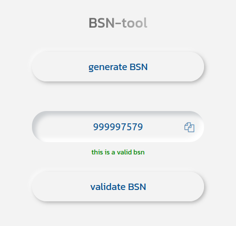

# BSN Tool

      

## What is this?

Fun little project using the [bsn-js](https://www.npmjs.com/package/bsn-js) npm package.

[live](https://willemverbuyst.github.io/bsn-tool/)

## On the page you can

- generate a test BSN (starting with '99999')
- validate an existing BSN

